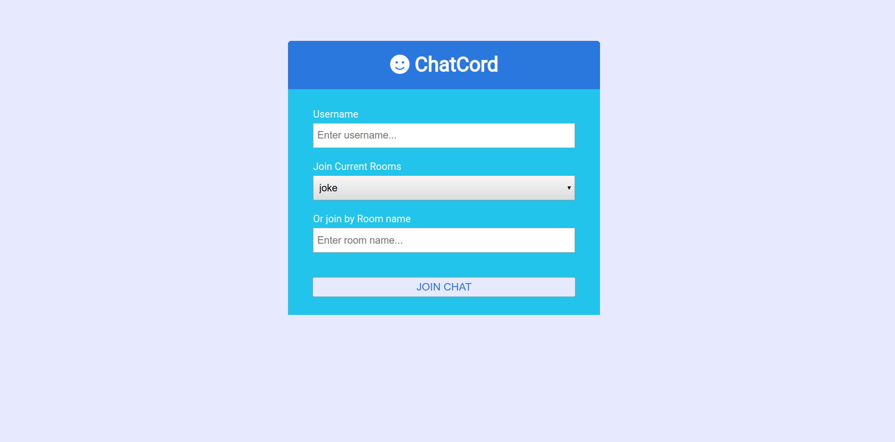
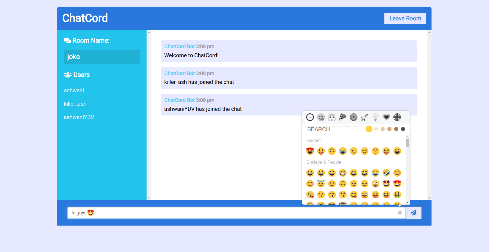
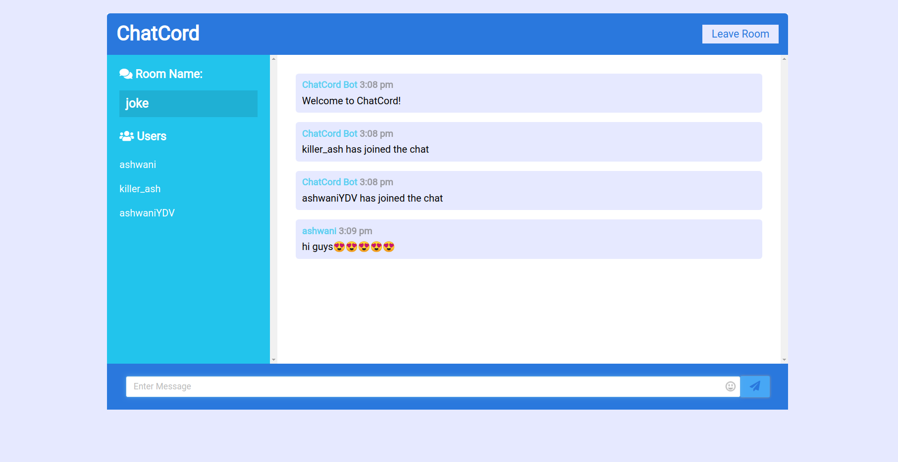
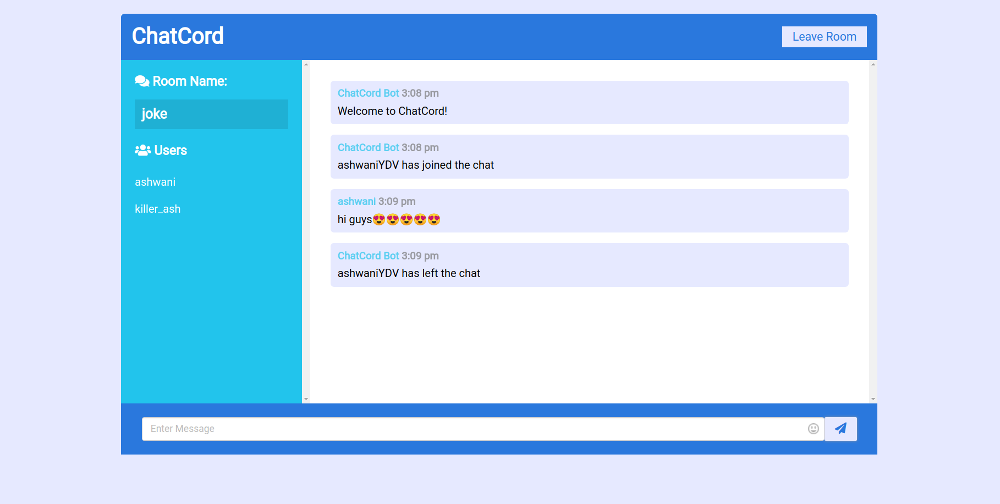

# ChatCord App
Realtime chat app with websockets using Node.js, Express and Socket.io with EJS as templating engine on the frontend with a custom UI

## Usage
```
# Install dependencies
npm install

# Run in development with hot reload
npm run dev
```

## Features
- [x] Chatcord bots to greet the new users and update the room users about joining and leaving of users
- [x] Emoji picker
- [x] Create a new room
- [x] Join an existing room on the server
- [ ] Send Files

## Screenshots



